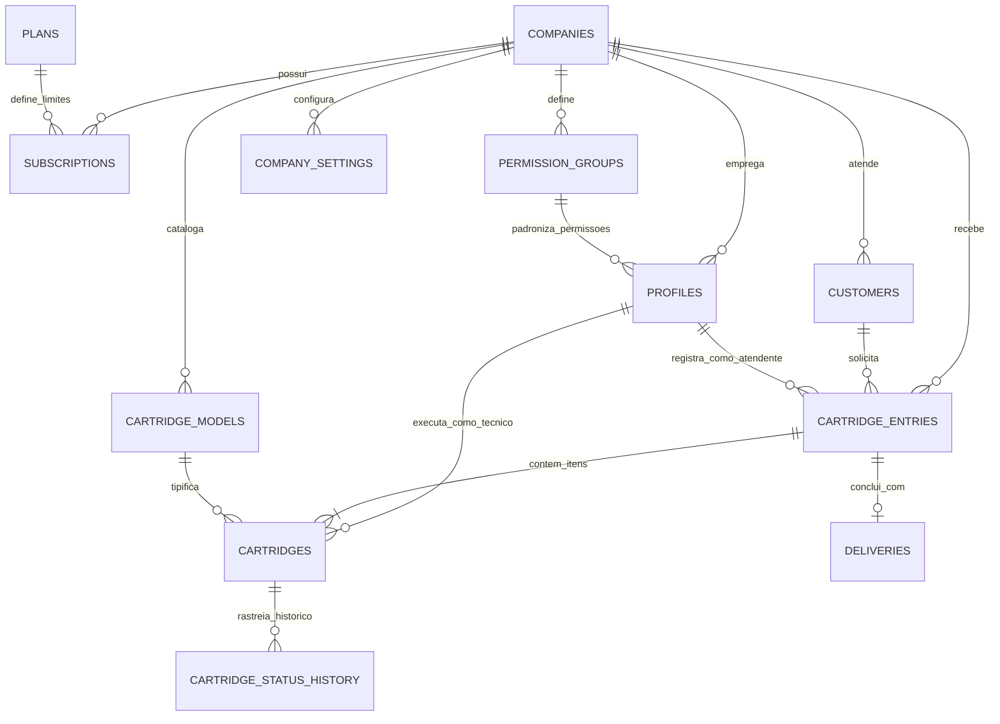
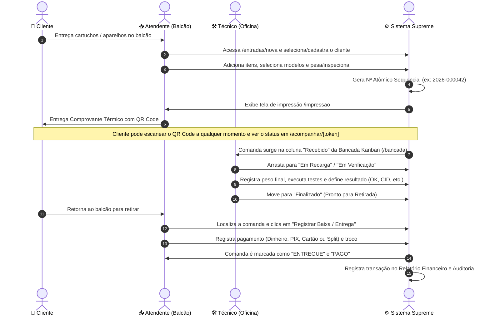

# 📖 Documentação de Estrutura e Funcionamento do Sistema
## Supreme Recargas 2 — Plataforma SaaS Multi-Tenant para Gestão de Recargas, Oficinas e Assistências Técnicas

---

## 📑 Sumário
1. [Visão Geral e Arquitetura](#1-visão-geral-e-arquitetura)
2. [Modelo de Negócio e Multi-Tenancy](#2-modelo-de-negócio-e-multi-tenancy)
3. [Estrutura do Banco de Dados (Schema Relacional)](#3-estrutura-do-banco-de-dados-schema-relacional)
4. [Sistema de Usuários, Limites e Grupos de Permissões (RBAC)](#4-sistema-de-usuários-limites-e-grupos-de-permissões-rbac)
5. [Customização por Ramo de Atuação (Multi-Segmento)](#5-customização-por-ramo-de-atuação-multi-segmento)
6. [Fluxo Operacional de Ponta a Ponta (Ciclo de Vida)](#6-fluxo-operacional-de-ponta-a-ponta-ciclo-de-vida)
7. [Mapeamento de Rotas e Telas](#7-mapeamento-de-rotas-e-telas)
8. [Camada de Persistência e Sincronização de Dados](#8-camada-de-persistência-e-sincronização-de-dados)
9. [Segurança e Row Level Security (RLS)](#9-segurança-e-row-level-security-rls)

---

## 1. Visão Geral e Arquitetura

O **Supreme Recargas 2** é um sistema completo de gestão operacional e financeira projetado especificamente para centros de recarga de cartuchos/toners, assistências técnicas de informática/celulares, oficinas de motores e prestadores de serviços de manutenção em geral.

### 🛠️ Stack Tecnológica:
- **Framework Front-End:** Next.js 16 (App Router com Turbopack e React 19).
- **Linguagem:** TypeScript (Tipagem estrita de ponta a ponta).
- **Estilização:** Tailwind CSS v4 com paleta neutra e suporte completo a **Modo Claro / Modo Escuro** nativo (sem dependências pesadas externas).
- **Ícones:** Lucide React.
- **Banco de Dados & Backend:** PostgreSQL hospedado no Supabase com extensão `uuid-ossp`, `pgcrypto` e políticas RLS (Row Level Security).
- **Camada de Dados Local & Offline-First:** Engine híbrida `AppStore` com suporte a `localStorage`, sincronização assíncrona com Supabase e eventos reativos em tempo real via `window.dispatchEvent`.

---

## 2. Modelo de Negócio e Multi-Tenancy

O sistema foi concebido sob a arquitetura **Multi-Tenant com Banco de Dados Compartilhado e Isolamento Lógico**:
- Cada empresa cliente (*tenant*) possui seus próprios registros de clientes, comandas, modelos, preços, relatórios e colaboradores.
- O campo `tenant_id` (UUID) está presente em todas as tabelas operacionais e é validado tanto pelo frontend quanto pelas políticas de segurança no banco de dados.

### Níveis de Acesso:
1. **Super Administrador (Proprietário do SaaS):**
   - Acesso ao painel `/super-admin`.
   - Cadastro e monitoramento de empresas clientes (*tenants*).
   - Criação e precificação de planos de assinatura.
   - Ajuste de limites e mensalidades customizadas por empresa.
   - Simulador de propostas comerciais com envio rápido para WhatsApp.
   - Gestão do Sandbox Demo com reset automático semanal de senhas.
2. **Administrador da Empresa:**
   - Gestão total da própria empresa (`/empresa`, `/dashboard`, `/relatorios`, `/auditoria`).
   - Gestão de equipe, cadastro de usuários e definição de grupos de permissões.
   - Configuração de segmento (cartuchos, celulares, motores, oficina geral) e políticas de validação.
3. **Atendente (Balcão de Atendimento):**
   - Entrada rápida de comandas (`/entradas/nova`).
   - Consulta e gerenciamento do histórico de entradas (`/entradas`).
   - Cadastro e consulta de clientes (`/clientes`).
   - Impressão térmica de comandas e etiquetas com QR Code (`/impressao`).
   - Registro de baixa financeira e entrega de itens prontos.
4. **Técnico (Oficina / Bancada Técnica):**
   - Acesso ao quadro visual Kanban da bancada técnica (`/bancada`).
   - Execução de testes elétricos, pesagem de entrada/saída com cálculo de tinta injetada.
   - Checklist de inspeção e aprovação/condenação técnica de cartuchos e aparelhos.

---

## 3. Estrutura do Banco de Dados (Schema Relacional)

Abaixo está o detalhamento de todas as tabelas, chaves primárias, estrangeiras e finalidade de cada entidade:



### 3.1. Tabelas de Gestão SaaS & Empresas

#### `plans` (Planos de Assinatura)
| Campo | Tipo | Descrição |
|---|---|---|
| `id` | UUID (PK) | Identificador único do plano |
| `name` | VARCHAR(100) | Nome comercial (ex: *Bronze*, *Prata*, *Ouro*, *Ilimitado*) |
| `code` | VARCHAR(50) | Código único do plano (ex: `PLANO_PRO`) |
| `description` | TEXT | Descrição resumida |
| `monthly_price` | NUMERIC(10,2) | Valor mensal base da assinatura |
| `max_users` | INT | Capacidade total unificada de usuários ativos inclusos |
| `extra_user_price`| NUMERIC(10,2) | Preço padrão cobrado por usuário adicional/mês |
| `features` | TEXT[] / JSONB | Lista de recursos inclusos |
| `is_active` | BOOLEAN | Se o plano está disponível para novas contratações |

#### `companies` (Empresas / Tenants)
| Campo | Tipo | Descrição |
|---|---|---|
| `id` | UUID (PK) | Identificador único do tenant |
| `corporate_name`| VARCHAR(255) | Razão Social |
| `trade_name` | VARCHAR(255) | Nome Fantasia exibido na interface e comprovantes |
| `cnpj` | VARCHAR(18) | CNPJ ou CPF da empresa |
| `phone` | VARCHAR(20) | Telefone principal |
| `whatsapp` | VARCHAR(20) | WhatsApp de contato corporativo |
| `email` | VARCHAR(255) | E-mail oficial |
| `city` / `state` | VARCHAR | Cidade e Estado (UF) |
| `business_segment`| ENUM / VARCHAR | Ramo de atuação (`RECARGA_CARTUCHOS`, etc.) |
| `is_active` | BOOLEAN | Status ativo/suspenso na plataforma |

#### `subscriptions` (Assinaturas das Empresas)
| Campo | Tipo | Descrição |
|---|---|---|
| `id` | UUID (PK) | Identificador da assinatura |
| `tenant_id` | UUID (FK `companies.id`) | Empresa vinculada |
| `plan_id` | UUID (FK `plans.id`) | Plano contratado |
| `status` | ENUM | `ACTIVE`, `TRIAL`, `PAUSED`, `EXPIRED`, `CANCELLED` |
| `starts_at` | TIMESTAMPTZ | Data de início da vigência |
| `expires_at`| TIMESTAMPTZ | Data de vencimento / renovação |
| `extra_users`| INT | Quantidade de usuários adicionais contratados |
| `custom_max_users`| INT | Capacidade máxima customizada (override de exceção) |
| `custom_price`| NUMERIC(10,2) | Mensalidade fixa negociada (override de exceção) |

---

### 3.2. Tabelas de Acesso e Permissões

#### `permission_groups` (Grupos de Permissões)
| Campo | Tipo | Descrição |
|---|---|---|
| `id` | UUID / String (PK) | Identificador do grupo |
| `tenant_id` | UUID (FK `companies.id`) | Nulo para grupos padrão do sistema ou ID do tenant |
| `name` | VARCHAR(100) | Nome do grupo (ex: *Gerente de Loja*, *Suporte*) |
| `description`| TEXT | Descrição das responsabilidades do grupo |
| `is_system_default`| BOOLEAN | `true` para Administrador, Atendente e Técnico |
| `default_role`| ENUM `user_role` | Papel base de compatibilidade |
| `permissions`| JSONB (`Record<string, boolean>`) | Dicionário de permissões ativas/inativas |

#### `profiles` (Usuários e Operadores)
| Campo | Tipo | Descrição |
|---|---|---|
| `id` | UUID (PK) | ID do usuário (mapeado para `auth.users.id`) |
| `tenant_id` | UUID (FK `companies.id`) | Empresa à qual o colaborador pertence |
| `full_name` | VARCHAR(255) | Nome completo do usuário |
| `email` | VARCHAR(255) | E-mail de login |
| `phone` | VARCHAR(20) | Telefone / WhatsApp de contato |
| `role` | ENUM `user_role` | Papel principal (`ADMINISTRADOR`, `ATENDENTE`, `TECNICO`, `SUPER_ADMIN`) |
| `group_id` | String / UUID | ID do grupo de permissão atribuído |
| `group_name`| VARCHAR(100) | Nome de exibição do grupo |
| `custom_permissions`| JSONB | Ajustes e exceções de permissão individuais do colaborador |
| `is_active` | BOOLEAN | Se o usuário está ativo ou desativado |

---

### 3.3. Tabelas de Clientes e Catálogo

#### `customers` (Clientes)
| Campo | Tipo | Descrição |
|---|---|---|
| `id` | UUID (PK) | Identificador do cliente |
| `tenant_id` | UUID (FK `companies.id`) | Empresa do cliente |
| `internal_code`| SERIAL / INT | Código numérico sequencial simples para busca rápida no balcão |
| `name` | VARCHAR(255) | Nome completo ou Razão Social |
| `document` | VARCHAR(20) | CPF ou CNPJ |
| `phone` | VARCHAR(20) | Telefone principal |
| `phone_is_whatsapp`| BOOLEAN | Indica se o telefone principal é WhatsApp |
| `secondary_phone`| VARCHAR(20) | Telefone secundário / fixo |
| `secondary_phone_is_whatsapp`| BOOLEAN | Indica se o telefone secundário é WhatsApp |
| `email` | VARCHAR(255) | E-mail para envio de comprovantes |
| `company_name`| VARCHAR(255) | Empresa de trabalho ou vínculo |
| `notes` | TEXT | Observações gerais sobre o cliente |

#### `cartridge_models` (Modelos e Itens Cadastrados)
| Campo | Tipo | Descrição |
|---|---|---|
| `id` | UUID (PK) | Identificador do modelo |
| `tenant_id` | UUID (FK `companies.id`) | Empresa proprietária do catálogo |
| `brand_name` | VARCHAR(100) | Fabricante / Marca (ex: *HP*, *Canon*, *Epson*, *Samsung*) |
| `model_name` | VARCHAR(100) | Código/Nome do modelo (ex: *HP 664*, *CL-146*, *Tela Moto G54*) |
| `category` | VARCHAR(100) | Categoria (ex: *Cartuchos*, *Smartphones*, *Notebooks*) |
| `color` | VARCHAR(50) | Preto, Colorido, Ciano, Magenta, Amarelo, etc. |
| `is_xl` | BOOLEAN | Indica se é modelo de alta capacidade (XL) |
| `capacity_ml`| NUMERIC(6,2) | Volume de tinta recomendado (ml) |
| `empty_weight_grams`| NUMERIC(6,2)| Peso do cartucho vazio (gramas) para conferência |
| `full_weight_grams`| NUMERIC(6,2) | Peso do cartucho cheio após recarga |
| `refill_price`| NUMERIC(10,2)| Preço padrão do serviço de recarga / manutenção |
| `verification_price`| NUMERIC(10,2)| Preço padrão da verificação / diagnóstico |
| `test_price` | NUMERIC(10,2)| Preço do teste de impressão |
| `is_active` | BOOLEAN | Ativo/Inativo no seletor de entrada |

---

### 3.4. Tabelas Operacionais (Comandas, Itens, Histórico e Baixa)

#### `cartridge_entries` (Comandas / Ordens de Serviço)
| Campo | Tipo | Descrição |
|---|---|---|
| `id` | UUID (PK) | Identificador único da entrada |
| `tenant_id` | UUID (FK `companies.id`) | Empresa emissora |
| `entry_number`| VARCHAR(30) | Número legível anual atômico (ex: `2026-000001`) |
| `entry_sequence`| INT | Sequencial numérico no ano (1, 2, 3...) |
| `entry_year` | INT | Ano da emissão (2026) |
| `customer_id`| UUID (FK `customers.id`) | Cliente solicitante |
| `attendant_id`| UUID (FK `profiles.id`) | Atendente que abriu o atendimento |
| `entry_date` | TIMESTAMPTZ | Data e hora de recepção |
| `subtotal_amount`| NUMERIC(10,2) | Soma dos valores brutos dos itens |
| `discount_amount`| NUMERIC(10,2) | Desconto concedido na entrada ou na entrega |
| `surcharge_amount`| NUMERIC(10,2) | Acréscimos ou taxas adicionais |
| `total_amount`| NUMERIC(10,2) | Valor líquido final da comanda |
| `payment_status`| ENUM | `PENDENTE`, `PAGO`, `ISENTO` |
| `payment_method`| ENUM | `DINHEIRO`, `PIX`, `CARTAO_DEBITO`, `CARTAO_CREDITO`, `A_PRAZO`, `ISENTO` |
| `tracking_token`| VARCHAR(64) | Token criptográfico único para rastreio pelo cliente sem login |

#### `cartridges` (Itens Individuais da Comanda)
| Campo | Tipo | Descrição |
|---|---|---|
| `id` | UUID (PK) | Identificador do item |
| `tenant_id` | UUID (FK `companies.id`) | Empresa do atendimento |
| `entry_id` | UUID (FK `cartridge_entries.id`) | Comanda pai vinculada |
| `serial_number`| VARCHAR(40) | Identificador completo do item (ex: `2026-000001-01`) |
| `item_index` | INT | Ordem do item na comanda (1, 2, 3...) |
| `model_id` | UUID (FK `cartridge_models.id`) | Modelo selecionado |
| `service_requested`| ENUM | `RECARGA`, `VERIFICACAO`, `VERIFICACAO_E_RECARGA`, `TESTE`, `OUTRO` |
| `final_serie` | VARCHAR(50) | Final de série, serial físico ou IMEI para conferência |
| `status` | ENUM `cartridge_status` | Status no pipeline (ex: `RECEBIDO`, `EM_RECARGA`, `FINALIZADO`) |
| `result_classification`| ENUM | `PENDENTE`, `OK`, `CID`, `QUEIMADO`, `FALHA_IMPRESSAO`, `ENTUPIDO`, `SEM_REPARO` |
| `technician_id`| UUID (FK `profiles.id`) | Técnico que assumiu/concluiu o item |
| `input_weight_grams`| NUMERIC(6,2) | Peso do item recebido na entrada (gramas) |
| `output_weight_grams`| NUMERIC(6,2)| Peso final pós-recarga (gramas) |
| `weight_diff_grams` | NUMERIC(6,2)| Quantidade líquida de tinta injetada (`output - input`) |
| `checklist` | JSONB | Lista de itens verificados na recepção (para celulares/motores) |
| `final_price` | NUMERIC(10,2) | Valor final cobrado por este item específico |

#### `cartridge_status_history` (Trilha de Histórico dos Itens)
Registra todas as passagens de status do item, registrando o operador responsável e timestamp para fins de rastreio e auditoria.

#### `deliveries` (Baixa e Entrega)
Registra os dados do recebedor, relação com o cliente (*Próprio Cliente*, *Funcionário*, *Familiar*), pagamentos parciais/totais (*Split Payments*), troco e data/hora da entrega.

#### `audit_logs` (Logs de Auditoria)
Registra operações sensíveis na empresa: reabertura de comanda, alteração de senhas, exclusão de registros e alteração de planos.

---

## 4. Sistema de Usuários, Limites e Grupos de Permissões (RBAC)

O sistema conta com uma estrutura unificada e flexível de controle de acesso:

```
┌─────────────────────────────────────────────────────────────┐
│                      Super Administrador                    │
│           (Acesso Global a todos os Tenants e SaaS)         │
└──────────────────────────────┬──────────────────────────────┘
                               │
            ┌──────────────────┴──────────────────┐
            ▼                                     ▼
┌───────────────────────┐             ┌───────────────────────┐
│     Plano Bronze      │             │      Plano Ouro       │
│  (Capacidade: 4 Users)│             │ (Capacidade: 15 Users)│
└───────────┬───────────┘             └───────────┬───────────┘
            │                                     │
            └──────────────────┬──────────────────┘
                               ▼
            ┌─────────────────────────────────────┐
            │   Capacidade Total de Usuários      │
            │ (maxUsers = plano + usuários extras)│
            │   Sem restrição de cota por cargo   │
            └──────────────────┬──────────────────┘
                               │
            ┌──────────────────┴──────────────────┐
            ▼                                     ▼
┌───────────────────────────────┐     ┌───────────────────────────────┐
│   Grupos Padrão do Sistema    │     │      Grupos Customizados      │
│ • Administrador               │     │ • Gerente de Loja             │
│ • Atendente (Balcão)          │     │ • Suporte Técnico             │
│ • Técnico (Bancada)           │     │ • Recepção / Estágio          │
└───────────────┬───────────────┘     └───────────────┬───────────────┘
                │                                     │
                └──────────────────┬──────────────────┘
                                   ▼
                    ┌─────────────────────────────┐
                    │    Colaborador / Usuário    │
                    │      (Perfil Profile)       │
                    │  + Permissões Individuais   │
                    │    (Override Opcional)      │
                    └─────────────────────────────┘
```

### 4.1. Unificação de Limites:
- As empresas contratam uma **capacidade total de usuários ativos** (ex: 5 usuários).
- Não há mais bloqueio se a empresa quiser cadastrar 3 técnicos e 2 atendentes ou 4 administradores e 1 técnico; a empresa distribui livremente os acessos até atingir a capacidade contratada.
- Usuários adicionais são contratados por uma taxa fixa padrão mensal (`extra_user_price`).

### 4.2. Algoritmo de Resolução de Permissões (`hasPermission(key)`):
1. **Super Administrador:** Retorna `true` para todas as funcionalidades.
2. **Override Individual (`currentUser.custom_permissions`):** Se o usuário tiver um valor booleano explícito para a permissão, essa definição tem prioridade máxima.
3. **Grupo de Permissões (`currentUser.group_id`):** O sistema consulta as permissões do grupo associado ao usuário em `permission_groups`.
4. **Fallback para Papel Base (`currentUser.role`):** Garante compatibilidade padrão caso o usuário não tenha grupo atribuído.

---

## 5. Customização por Ramo de Atuação (Multi-Segmento)

O sistema permite que o administrador selecione o nicho de atuação da sua assistência com 1 clique na aba **Ramo & Checklist** em `/empresa`:

| Preset | Nomenclatura do Item | Identificador | Balança / Pesagem | Checklist de Inspeção |
|---|---|---|---|---|
| **Recarga de Cartuchos** | Cartucho / Cartuchos | Final de Série | ✅ Sim (gramas e ml) | ❌ Opcional |
| **Assistência de Celulares e Informática** | Aparelho / Aparelhos | IMEI / Nº de Série | ❌ Não | ✅ Sim (Tela, Carregador, Riscos, etc.) |
| **Ferramentas e Motores** | Equipamento / Equipamentos | Nº de Série / Código | ❌ Não | ✅ Sim (Escovas, Cabo, Carcaça, etc.) |
| **Oficina Geral / Prestador** | Item / Itens | Código de Identificação | ❌ Não | ✅ Sim (Checklist Livre) |

---

## 6. Fluxo Operacional de Ponta a Ponta (Ciclo de Vida)



---

## 7. Mapeamento de Rotas e Telas

| Rota | Nome da Tela | Acesso Permitido | Principais Funcionalidades |
|---|---|---|---|
| `/dashboard` | Painel Principal | Todos | KPIs do dia, faturamento em tempo real, fila da oficina e atalhos operacionais |
| `/entradas/nova` | Nova Entrada | Atendentes / Admins | Abertura ágil de comandas com autocompletar de clientes e cálculo de preços |
| `/entradas` | Entradas & Entregas | Atendentes / Admins | Lista geral de comandas, filtros por status, conferência e modal de baixa |
| `/bancada` | Bancada Técnica (Kanban) | Técnicos / Admins | Quadro Kanban com colunas personalizáveis, pesagem e diagnóstico |
| `/clientes` | Gestão de Clientes | Atendentes / Admins | Catálogo de clientes, telefones com tag WhatsApp e histórico de compras |
| `/modelos` | Catálogo & Preços | Administradores | Cadastro de modelos, preços por serviço e tabelas promocionais |
| `/relatorios` | Relatórios Financeiros | Administradores | Faturamento por período, formas de pagamento, serviços mais lucrativos |
| `/auditoria` | Trilha de Auditoria | Administradores | Logs de operações de usuários, mudanças de preço e reaberturas |
| `/empresa` | Gestão da Empresa | Administradores | Equipe, grupos de permissões, políticas de validação e segmento |
| `/super-admin` | Central do SaaS | Super Admin | Gestão de clientes SaaS, planos, faturamento MRR e simulador comercial |
| `/acompanhar/[token]` | Rastreio Público | Público / Clientes | Visualização limpa e responsiva do status da comanda sem necessidade de login |
| `/demo` | Ambiente de Demonstração | Público / Visitantes | Acesso sandbox para testes de visitantes com credenciais rotativas |
| `/impressao` | Visualizador de Impressão | Atendentes / Admins | Renderização para impressoras térmicas (58mm/80mm) e etiquetas de bancada |

---

## 8. Camada de Persistência e Sincronização de Dados

O projeto utiliza um padrão de persistência robusto estruturado na classe `AppStore` ([`src/lib/store.ts`](file:///d:/Projetos/Supreme%20Recargas%202/src/lib/store.ts)):

1. **Memória & LocalStorage:**
   - Permite resposta instantânea da interface (zero delay visual) e funcionamento imediato mesmo em conexões instáveis.
   - Chave central: `supreme_recargas_v2_store`.
2. **Disparo de Eventos Reativos:**
   - Sempre que uma mutação ocorre (`addUser`, `addEntry`, `updateCartridgeStatus`, etc.), o `AppStore` dispara o evento global `window.dispatchEvent(new CustomEvent('supreme_store_updated'))`.
   - Todas as telas e componentes escutam esse evento e atualizam seu estado em tempo real sem necessidade de recarregar a página.
3. **Persistência Assíncrona no Supabase:**
   - Operações críticas disparam chamadas assíncronas para o cliente Supabase (`supabase.from('...').upsert(...)`).

---

## 9. Segurança e Row Level Security (RLS)

O banco de dados PostgreSQL possui isolamento estrito via RLS ([`supabase/migrations/0002_rls_policies.sql`](file:///d:/Projetos/Supreme%20Recargas%202/supabase/migrations/0002_rls_policies.sql)):
- A função auxiliar `current_user_tenant_id()` recupera dinamicamente a qual empresa o usuário autenticado pertence.
- A função `is_super_admin()` valida privilégios de manutenção central.
- Todas as políticas `SELECT`, `INSERT`, `UPDATE` e `DELETE` em tabelas operacionais impõem `tenant_id = current_user_tenant_id() OR is_super_admin()`, impossibilitando que qualquer empresa acesse dados de outra.

---

## 10. Conclusão e Prontidão do Projeto

O sistema encontra-se com sua arquitetura totalmente padronizada, tipada em TypeScript, com visual moderno nos modos Claro e Escuro, e pronto para escalabilidade comercial como SaaS.
